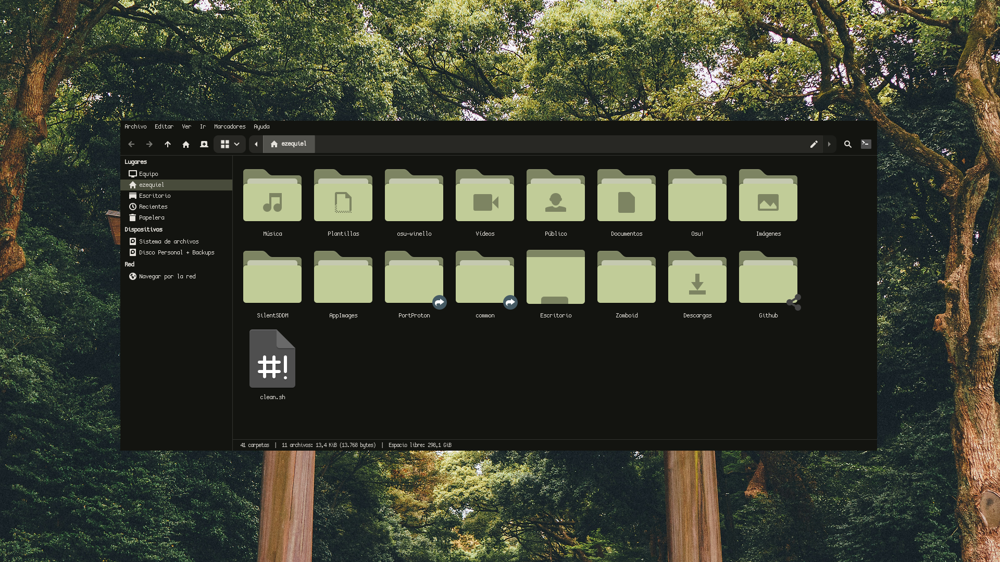
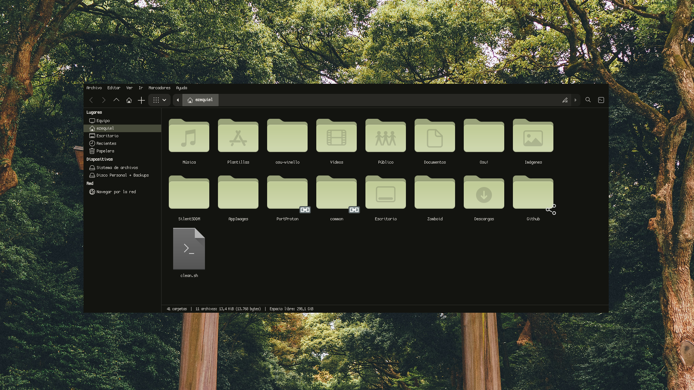
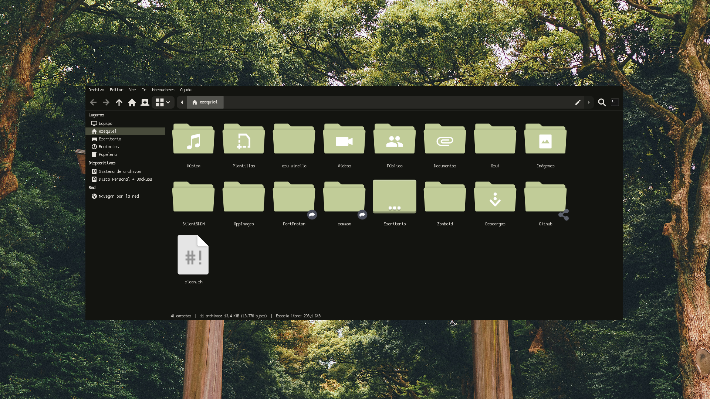

# noctalia-dynamic-icons

Dynamic icons for GTK file managers (Nemo, Thunar, Nautilus, Caja). Estos scripts permiten aplicar iconos dinámicos de forma sencilla en diferentes entornos de escritorio.

---

## 🎨 Temas Disponibles

### Papirus-Dark

Para instalar el tema Papirus-Dark, ejecuta el siguiente comando:
```bash
bash (curl -fsSL https://raw.githubusercontent.com/ezequielgk/noctalia-dynamic-icons/main/papirus.sh | psub)

```

---

### Colloid-Dark 

*Actualmente bajo mantenimiento. Úselo con precaución.*

```bash
bash (curl -fsSL https://raw.githubusercontent.com/ezequielgk/noctalia-dynamic-icons/main/colloid.sh | psub)

```

---

### Flat-Remix-Dark

Para instalar el tema Flat-Remix-Dark:

```bash
bash (curl -fsSL https://raw.githubusercontent.com/ezequielgk/noctalia-dynamic-icons/main/flat-remix.sh | psub)


```

---

### Tela-Dark (⚠️ Under maintenance)

Para instalar el tema Tela-Dark:

```bash
bash (curl -fsSL https://raw.githubusercontent.com/ezequielgk/noctalia-dynamic-icons/main/tela.sh | psub)


```

---

## 🛠️ Requisitos

* Gestores de archivos compatibles: Nemo, Thunar, Nautilus o Caja.
